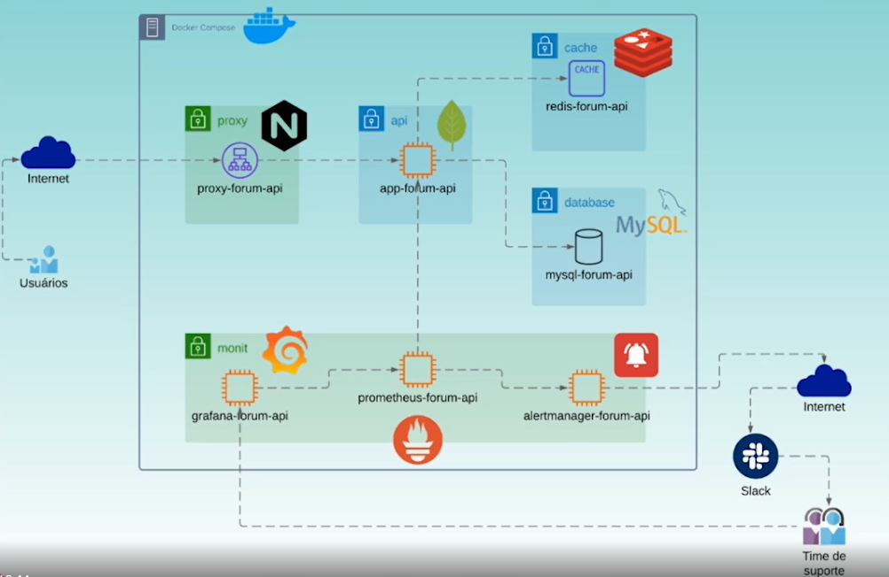

# PROMETHEUS - GRAFANA

<h1 align="center">
  
</h1>

Implementação de observabilidade utilizando Prometheus, Grafana e Alert Manager em uma API REST em Java.

O Actuator é um recurso do Spring Boot que nos permite monitorar e gerenciar aplicações escritas neste framework em seu ambiente de implantação.

Quanto ela está consumindo de CPU?
Qual o tempo de resposta que os meus clientes estão tendo? 
Quanto ela está usando de memória?
Como está a conexão com a base de dados?
Qual a duração de uma requisição?
Estou tendo algum erro?
Tem algum cliente com erro?